# Numerical Tools in Machine Learning for Aerospace Engineering

Linear regression, classification and Neural Networks projects.

## Heart Disease Prediction

## Linear Regression
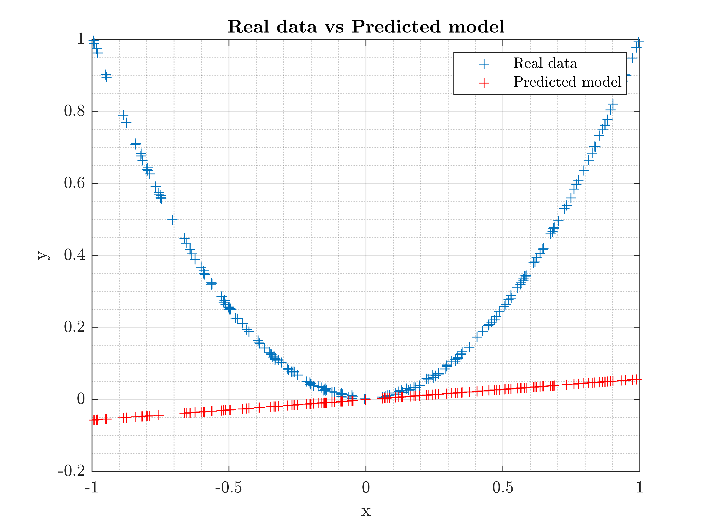
MSE as a function of folds using k-fold algorithm.
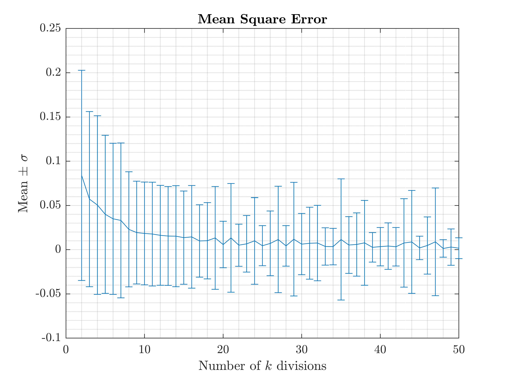

## One vs All 
Iris data set
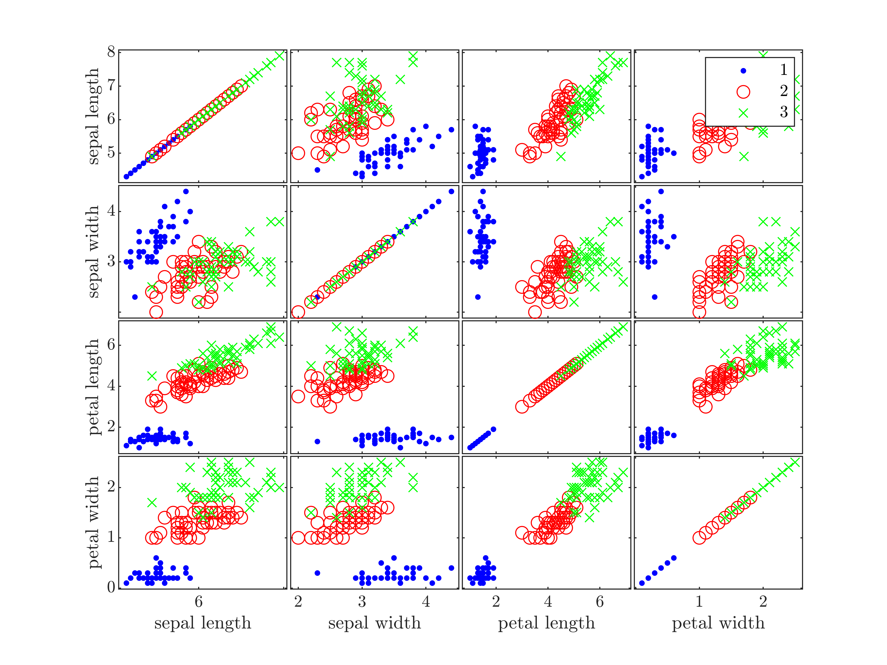

## Neural Networks

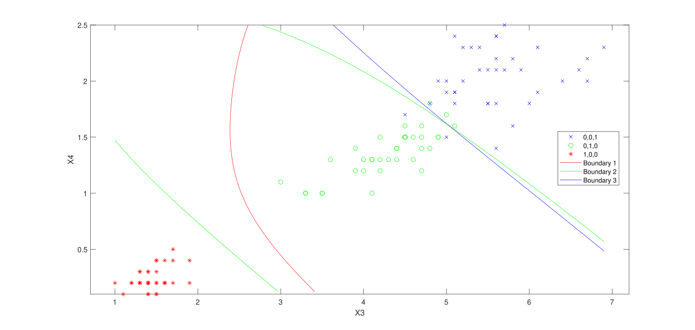
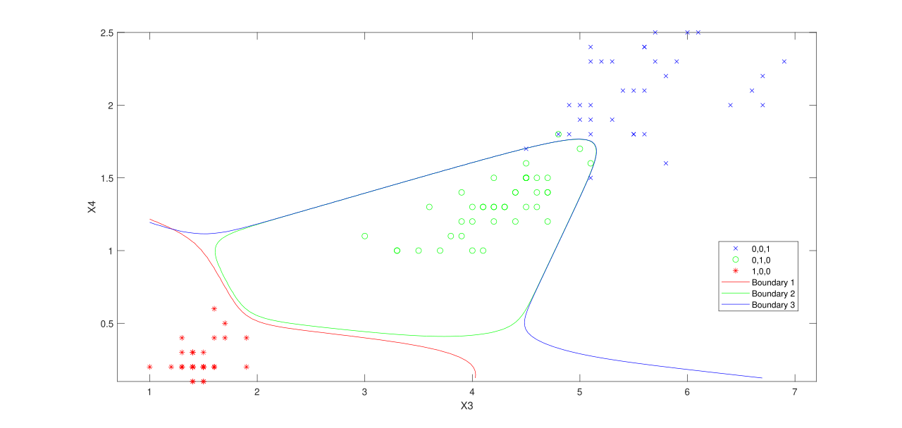
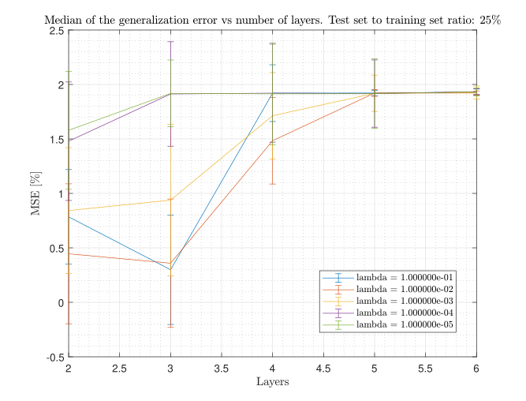
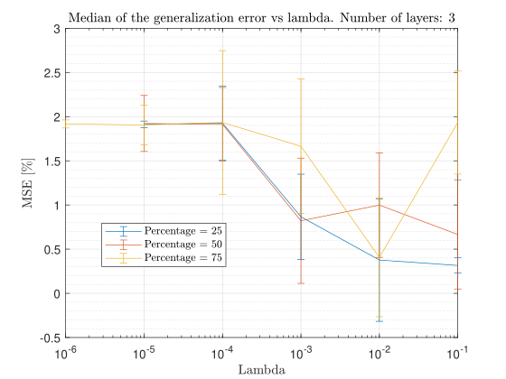

## Image Recognition 

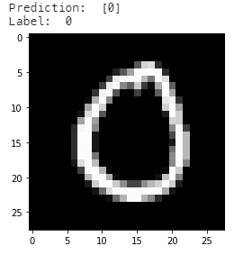
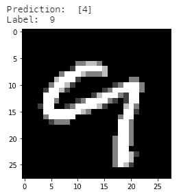
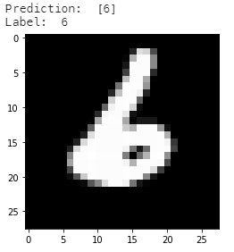
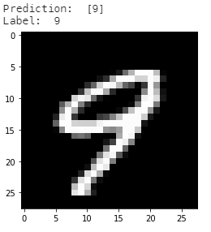
